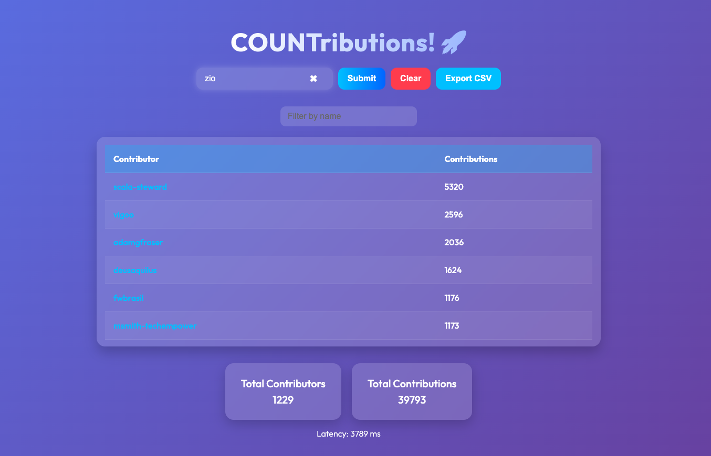

Video demo: https://www.youtube.com/watch?v=fPmFuC7H12E

Blog version: [https://blog.rockthejvm.com/cats-effect-parallelism/](https://rockthejvm.com/articles/functional-parallel-programming-with-scala-and-cats-effect)

Frontend:


Running locally:
- clone the repo
- navigate to root directory
- `sbt run`
- hit localhost:9000

Some people say that functional programming is slow. This app demonstrates that they are bulshitting.

Parallelism is a piece of cake when programs are expressions which can be composed and manipulated like normal strings and integers.

The app aggregates all the contributors for a certain GitHub organization and sorts them by their contributions.

The parallelism is only limited by the restrictions GitHub REST API.

However since `cats-effect` Runtime works on `Fiber`-s, it's inexpensive to abuse them 😄

You are welcome to improve the implementation.

`curl localhost:9000/org/{org_name}` will yield sorted JSON response which looks like:
```json
{
  "count": 3,
  "contributors": [
    {
      "login": "user1",
      "contributions": 5000
    },
    {
      "login": "user2",
      "contributions": 2500
    },
    {
      "login": "user3",
      "contributions": 1000
    }
  ]
}
```

Latency benchmarks for different organizations: 
- [quantori](json/quantori.json) - 3 seconds, 59 public repos, 604 contributors
- [typelevel](json/typelevel.json) - 4 seconds, 101 public repos, 1077 contributors
- [zio](json/zio.json) - 4 seconds, 94 public repos, 1276 contributors
- [lightbend](json/lightbend.json) - 5 seconds, 109 public repos, 1558 contributors
- [facebook](json/facebook.json) - 6 seconds, 128 public repos, 8687 contributors
- [apache](json/apache.json) - 10 seconds, 2534 repos, 10818 contributors
- [google](json/google.json) - 14 seconds, 2560 public repos, 12796 contributors


